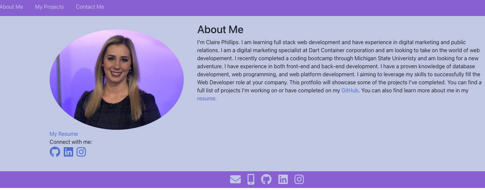
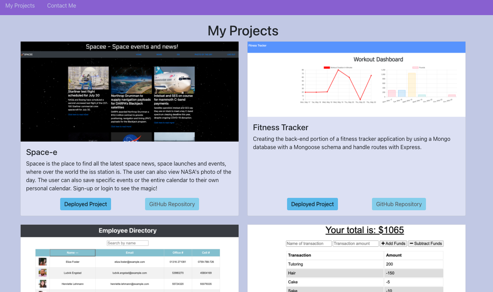
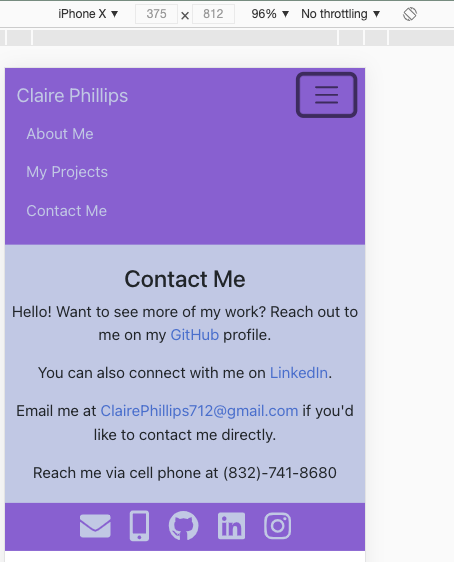
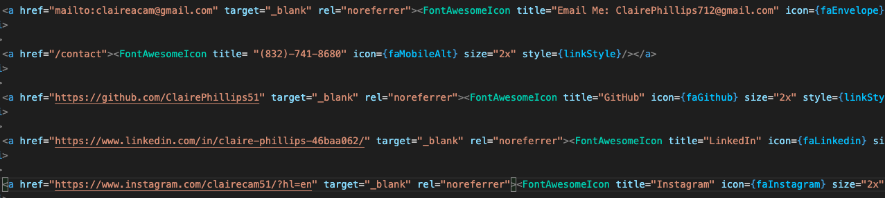

# react portfolio

## Links
Link to deployed application [GitHub Pages Link](https://clairephillips51.github.io/react-portfolio/#/)

## Summary
 Creating a multi-page portfolio using React and React Router for navigation. Displaying skills using some of the latest technologies. 

## Table of Contents
1. [Usage](#usage)
2. [SetUp](#setup)
3. [What I Learned](#what-i-learned)
4. [Resources](#resources)
5. [Getting Started with Create React App](#getting-started-with-create-react-app)

## Usage
Creating a multi-page portfolio using react with hash-router to manage the different paths and make for smooth transition between page views. The user can find the About Me page that gives a brief introductory paragraph and has a picture, a link to my resume, my email, my github profile, and some social links.  

The projects page has cards holding the different projects with a picture of the individual project, a brief description, and links to the deployed application and to the GitHub repo for each project. The contact me page is short and holds additional links to my email, linkedIn profile, and GitHub profile. The footer also contains font awesome icons that are links to the same content and a link to my instagram account. 

## Setup
This application is comprised of three pages (About Me, Projects, and Contact Me) and three components (the header, footer, and projects). The header and footer components are on all three pages and the projects component uses props so that it can be resued multiple times on the project page. The whole application is built with a mobile-first mind set which is why I used bootstrap as it's easer to change the what the app looks like using the grid system and column breakpoints.  

## What I Learned
This project was the first practical practice I had with react router and using hash router. During the development phase of the portfolio I used the basic react router to navigate between pages and then before deploying it to github pages I changed it to hash router. 

The most time consuming part of this project was actually getting the font awesome icons to render correctly. I initally tried adding the link tag to the html document, but it still didn't work correctly some after some googling I decided to install it as a dependency and use the font awesome react component. I also struggled figuring out that I had to import the individual font-awesome icons at the top the footer.js component file. 

I also used a css :root pseudo class for colors and was happy that I was able to set it in the app.css style sheet and use it on other css pages without having to import it to each page. There were some components were I had to use in-line styling for to overwrtie the bootstrap styling. I enjoyed working on this and hope to add improved styling and animation as I continue to work on this project. 

## Resources
* [Hash Router](https://reactrouter.com/web/api/HashRouter)
* [React Font awesome](https://fontawesome.com/v5.15/how-to-use/on-the-web/using-with/react)
* [Css root](https://developer.mozilla.org/en-US/docs/Web/CSS/:root)
* [React bootstrap](https://react-bootstrap.github.io/getting-started/introduction) 

# Getting Started with Create React App

This project was bootstrapped with [Create React App](https://github.com/facebook/create-react-app).

## Available Scripts

In the project directory, you can run:

### `npm start`

Runs the app in the development mode.\
Open [http://localhost:3000](http://localhost:3000) to view it in the browser.

The page will reload if you make edits.\
You will also see any lint errors in the console.

### `npm test`

Launches the test runner in the interactive watch mode.\
See the section about [running tests](https://facebook.github.io/create-react-app/docs/running-tests) for more information.

### `npm run build`

Builds the app for production to the `build` folder.\
It correctly bundles React in production mode and optimizes the build for the best performance.

The build is minified and the filenames include the hashes.\
Your app is ready to be deployed!

See the section about [deployment](https://facebook.github.io/create-react-app/docs/deployment) for more information.

### `npm run eject`

**Note: this is a one-way operation. Once you `eject`, you can’t go back!**

If you aren’t satisfied with the build tool and configuration choices, you can `eject` at any time. This command will remove the single build dependency from your project.

Instead, it will copy all the configuration files and the transitive dependencies (webpack, Babel, ESLint, etc) right into your project so you have full control over them. All of the commands except `eject` will still work, but they will point to the copied scripts so you can tweak them. At this point you’re on your own.

You don’t have to ever use `eject`. The curated feature set is suitable for small and middle deployments, and you shouldn’t feel obligated to use this feature. However we understand that this tool wouldn’t be useful if you couldn’t customize it when you are ready for it.

## Learn More

You can learn more in the [Create React App documentation](https://facebook.github.io/create-react-app/docs/getting-started).

To learn React, check out the [React documentation](https://reactjs.org/).

### Code Splitting

This section has moved here: [https://facebook.github.io/create-react-app/docs/code-splitting](https://facebook.github.io/create-react-app/docs/code-splitting)

### Analyzing the Bundle Size

This section has moved here: [https://facebook.github.io/create-react-app/docs/analyzing-the-bundle-size](https://facebook.github.io/create-react-app/docs/analyzing-the-bundle-size)

### Making a Progressive Web App

This section has moved here: [https://facebook.github.io/create-react-app/docs/making-a-progressive-web-app](https://facebook.github.io/create-react-app/docs/making-a-progressive-web-app)

### Advanced Configuration

This section has moved here: [https://facebook.github.io/create-react-app/docs/advanced-configuration](https://facebook.github.io/create-react-app/docs/advanced-configuration)

### Deployment

This section has moved here: [https://facebook.github.io/create-react-app/docs/deployment](https://facebook.github.io/create-react-app/docs/deployment)

### `npm run build` fails to minify

This section has moved here: [https://facebook.github.io/create-react-app/docs/troubleshooting#npm-run-build-fails-to-minify](https://facebook.github.io/create-react-app/docs/troubleshooting#npm-run-build-fails-to-minify)
